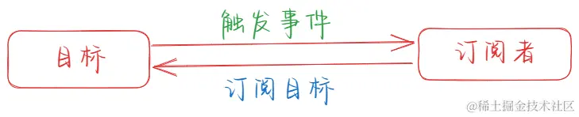
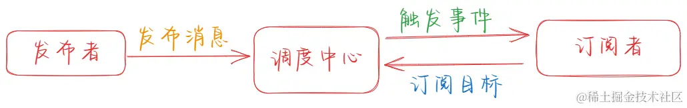

# 发布-订阅模式

## 定义

核心思想 ‌ 是将消息的发送者（称为发布者）与消息的接收者（称为订阅者）解耦。发布者发布消息时，不需要知道具体的订阅者是谁，同样，订阅者订阅消息时也不需要知道具体的发布者是谁 ‌

## 与观察者的区别

最大的区别就是发布-订阅模式有一个调度中心，观察者模式的发布者和订阅者是存在依赖关系的，而发布-订阅模式则不会，这就实现了解耦。

## 优点

- 解耦
- 异步
- 动态
- 可复用性

## 缺点

- 内存泄露
- 性能问题
- 调试困难
- 难以维护

## 应用场景

- DOM 事件处理
- 事件总线：Event Bus
- 全局状态管理： Redux
- 消息通知：

## 实现
